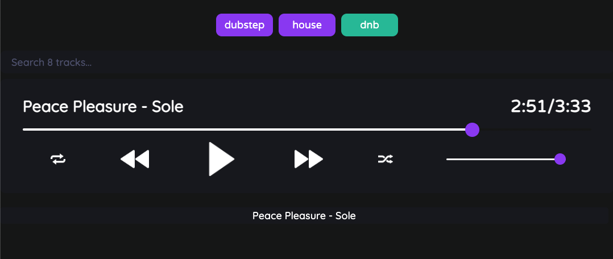

<div id="top"></div>

<!-- PROJECT SHIELDS -->
<!--
*** using markdown "reference style" links for readability.
*** Reference links are enclosed in brackets [ ] instead of parentheses ( ).
*** See the bottom of this document for the declaration of the reference variables
*** https://www.markdownguide.org/basic-syntax/#reference-style-links
-->

<!-- [![Contributors][contributors-shield]][contributors-url]
[![Forks][forks-shield]][forks-url]
[![Stargazers][stars-shield]][stars-url] -->

[![Issues][issues-shield]][issues-url]
[![MIT License][license-shield]][license-url]
[![LinkedIn][linkedin-shield]][linkedin-url]

<!-- PROJECT LOGO -->
<br />
<div align="center">
  <a href="https://github.com/alexgeis/music-player">
    
  </a>

<h3 align="center">Music Player</h3>

  <p align="center">
    A player for showcasing my music.
    <br />
    <a href="https://github.com/alexgeis/music-player"><strong>Explore the docs »</strong></a>
    <br />
    <br />
    <a class="deployed_link" href="music-player-ang.netlify.app">View Demo</a>
    ·
    <a href="https://github.com/alexgeis/music-player/issues">Report Bug</a>
    ·
    <a href="https://github.com/alexgeis/music-player/issues">Request Feature</a>
  </p>
</div>

<!-- TABLE OF CONTENTS -->
<details>
  <summary>Table of Contents</summary>
  <ol>
    <li>
      <a href="#about-the-project">About The Project</a>
      <ul>
        <li><a href="#built-with">Built With</a></li>
      </ul>
    </li>
    <li>
      <a href="#getting-started">Getting Started</a>
      <ul>
        <li><a href="#prerequisites">Prerequisites</a></li>
        <li><a href="#installation">Installation</a></li>
      </ul>
    </li>
    <li><a href="#usage">Usage</a></li>
    <li><a href="#roadmap">Roadmap</a></li>
    <li><a href="#contributing">Contributing</a></li>
    <li><a href="#license">License</a></li>
    <li><a href="#contact">Contact</a></li>
    <li><a href="#acknowledgments">Acknowledgments</a></li>
  </ol>
</details>

<!-- ABOUT THE PROJECT -->

## About The Project

<!-- [![Product Name Screen Shot][product-screenshot]](music-player-ang.netlify.app) -->
<a class="deployed_link" href="music-player-ang.netlify.app">
<p align="center">
</p></a>

<p align="right">(<a href="#top">back to top</a>)</p>

### Built With

<!-- - [Webpack](https://webpack.js.org/) -->

- [React.js](https://reactjs.org/)
<!-- - [Bootstrap](https://getbootstrap.com)
- [Node.js](https://nodejs.dev/)
- [Express](https://expressjs.com/)
- [MongoDB](https://www.mongodb.com/)
- [MySQL](https://www.mysql.com/)
- [JQuery](https://jquery.com) -->

<p align="right">(<a href="#top">back to top</a>)</p>

<!-- GETTING STARTED -->

## Getting Started

Instructions on setting up your project locally.
To get a local copy up and running follow these simple example steps.

### Prerequisites

This is an example of how to list things you need to use the software and how to install them.

- npm
  ```sh
  npm install npm@latest -g
  ```

<!-- PREREQ EXAMPLE
Packages used in this project: -->
<!-- - npm
- css-loader
- html-loader
- html-webpack-plugin
- style-loader
- webpack
- webpack-cli
- webpack-dev-server
  ```sh
  npm install npm@latest css-loader html-loader html-webpack-plugin style-loader webpack webpack-cli webpack-dev-server -g
  ``` -->

### Installation

1. Clone the repo
   ```sh
   git clone https://github.com/alexgeis/music-player.git
   ```
2. Install NPM packages
   ```sh
   npm install
   ```
3. DEVELOPMENT - run "npm start" to spin up the development server
   ```sh
   npm start
   ```
   <!-- 4. PRODUCTION - run "npm build" to bundle the page per the Webpack settings
      ```sh
      npm build
      ``` -->

<!-- API EXAMPLE
1. Get a free API Key at [https://example.com](https://example.com)
2. Clone the repo
   ```sh
   git clone https://github.com/alexgeis/music-player.git
   ```
3. Install NPM packages
   ```sh
   npm install
   ```
4. Enter your API in `config.js`
   ```js
   const API_KEY = "ENTER YOUR API";
   ``` -->

<p align="right">(<a href="#top">back to top</a>)</p>

<!-- USAGE EXAMPLES -->

## Usage

Use the player buttons (play, pause, shuffle, skip, etc.) to navigate through the playlist, and utilize the search bar to quickly find a specific track.

Genre labels at the top of the player can be used to filter for specific sounds, and can be deselected if needed.

<!-- _For more examples, please refer to the [Documentation](https://example.com)_ -->

<p align="right">(<a href="#top">back to top</a>)</p>

<!-- ROADMAP -->

## Roadmap

- [ ] Upload more music
- [ ] Update color scheme
- [ ] Ability to include album art
- [ ] Ability to add URLs for a song/artist
- [ ] Add individual artist spotlight pages
- [ ] More filter options (song length, sort by played/unplayed, bpm)
- [ ] More song info (bpm, key, album, art, etc.)

See the [open issues](https://github.com/alexgeis/music-player/issues) for a full list of proposed features (and known issues).

<p align="right">(<a href="#top">back to top</a>)</p>

<!-- CONTRIBUTING -->

## Contributing

Any contributions you make are **greatly appreciated**.

Please try to create bug reports that are:

- _Reproducible_. Include steps to reproduce the problem.
- _Specific_. Include as much detail as possible: which version, what environment, etc.
- _Unique_. Do not duplicate existing opened issues.
- _Scoped_ to a Single Bug. One bug per report.

If you have a suggestion that would make this better, please fork the repo and create a pull request. You can also simply open an issue with the tag "enhancement".
Don't forget to give the project a star! Thanks again!

1. Fork the Project
2. Create your Feature Branch (`git checkout -b feature/AmazingFeature`)
3. Commit your Changes (`git commit -m 'Add some AmazingFeature'`)
4. Push to the Branch (`git push origin feature/AmazingFeature`)
5. Open a Pull Request

<p align="right">(<a href="#top">back to top</a>)</p>

<!-- LICENSE -->

## License

Distributed under the MIT License. See `LICENSE.txt` for more information.

<p align="right">(<a href="#top">back to top</a>)</p>

<!-- CONTACT -->

## Contact

Alex Geis - siegxela@gmail.com

Project Link: [https://github.com/alexgeis/music-player](https://github.com/alexgeis/music-player)

<p align="right">(<a href="#top">back to top</a>)</p>

<!-- ACKNOWLEDGMENTS -->

## Acknowledgments

Helpful resources and kudos.

- [Choose an Open Source License](https://choosealicense.com)
<!-- - [Img Shields](https://shields.io)
- [GitHub Pages](https://pages.github.com)
- [Font Awesome](https://fontawesome.com)
- [React Icons](https://react-icons.github.io/react-icons/search)
- [Markdown Studio](https://readme.so/editor) -->
- Shoutout to [Madza](https://www.madza.dev/) for the helpful walkthrough on creating this player in React.js
<!-- - []()
- []() -->

<p align="right">(<a href="#top">back to top</a>)</p>

<!-- MARKDOWN LINKS & IMAGES -->
<!-- https://www.markdownguide.org/basic-syntax/#reference-style-links -->

<!-- [contributors-shield]: https://img.shields.io/github/contributors/alexgeis/music-player.svg?style=for-the-badge
[contributors-url]: https://github.com/alexgeis/music-player/graphs/contributors
[forks-shield]: https://img.shields.io/github/forks/alexgeis/music-player.svg?style=for-the-badge
[forks-url]: https://github.com/alexgeis/music-player/network/members
[stars-shield]: https://img.shields.io/github/stars/alexgeis/music-player.svg?style=for-the-badge
[stars-url]: https://github.com/alexgeis/music-player/stargazers -->

[issues-shield]: https://img.shields.io/github/issues/alexgeis/music-player.svg?style=for-the-badge
[issues-url]: https://github.com/alexgeis/music-player/issues
[license-shield]: https://img.shields.io/github/license/alexgeis/music-player.svg?style=for-the-badge
[license-url]: https://github.com/alexgeis/music-player/blob/master/LICENSE.txt
[linkedin-shield]: https://img.shields.io/badge/-LinkedIn-black.svg?style=for-the-badge&logo=linkedin&colorB=555
[linkedin-url]: https://linkedin.com/in/alexngeis
[product-screenshot]: client/src/assets/img/player-screenshot.png
